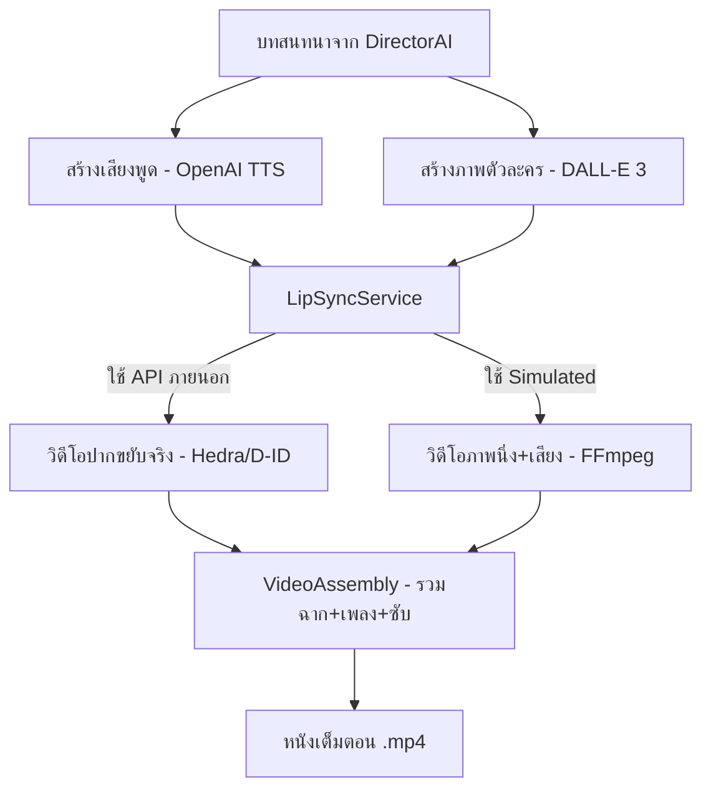

# รายงานสถานะระบบสร้างวิดีโอและ Lip-sync

## 🎬 สถานะปัจจุบัน (Current Status)

ระบบ **Lip-sync (ตัวละครขยับปากพูด)** มีโครงสร้างพื้นฐานที่ **"พร้อมทำงาน" (Infrastructure Ready)** แต่ยังขาดการตั้งค่า API ภายนอกเพื่อให้เห็นผลลัพธ์ที่สมจริง

### สิ่งที่มีอยู่แล้ว (What we have):
1. **LipSyncService:** รองรับการเชื่อมต่อกับ **Hedra API** (แนะนำ) และ **D-ID API**
2. **MoviePipeline:** ระบบที่ร้อยเรียงขั้นตอนตั้งแต่:
   - DirectorAI (สร้างบท) → ImageService (สร้างภาพ) → VoiceService (สร้างเสียง) → LipSyncService (ทำปากขยับ) → VideoAssembly (รวมเป็นหนัง)
3. **Simulated Mode:** ระบบทดสอบที่สามารถรวมภาพนิ่งกับเสียงเป็นวิดีโอได้ทันทีโดยไม่ต้องใช้ API ภายนอก (ปากจะไม่ขยับจริง แต่จะได้ไฟล์วิดีโอ MP4)
4. **VideoAssemblyService:** ระบบรวมหลายฉากเข้าด้วยกัน, ใส่เพลงประกอบ, และใส่ซับไตเติ้ล

---

## 🛠 สิ่งที่ยังขาดเพื่อให้ "ปากขยับจริง" (What's Missing for Real Lip-sync)

เพื่อให้ตัวละครขยับปากได้สมจริง คุณต้องดำเนินการดังนี้:

### 1. การตั้งค่า API Key (External APIs)
ระบบ Lip-sync จริงต้องพึ่งพา AI ภายนอกที่เชี่ยวชาญด้านการขยับใบหน้า:
- **Hedra API Key:** (แนะนำ) ให้คุณภาพสูงและขยับทั้งใบหน้าได้เป็นธรรมชาติ
- **D-ID API Key:** เป็นทางเลือกยอดนิยมสำหรับภาพ Portrait
- **วิธีการ:** นำ API Key ไปใส่ในไฟล์ `.env`
  ```env
  HEDRA_API_KEY=your_key_here
  # หรือ
  DID_API_KEY=your_key_here
  ```

### 2. การติดตั้ง FFmpeg ในเครื่อง (System Dependency)
ระบบรวมวิดีโอ (Video Assembly) และระบบจำลอง (Simulated) จำเป็นต้องใช้ FFmpeg:
- **คำสั่งติดตั้ง:** `sudo apt install ffmpeg` (ใน Ubuntu)

### 3. เครดิตการใช้งาน (Usage Credits)
- การสร้างวิดีโอ Lip-sync มีค่าใช้จ่ายเป็นเครดิตตามแต่ละ Provider (Hedra/D-ID) ดังนั้นต้องตรวจสอบยอดเงินในบัญชีเหล่านั้นด้วย

---

## 🚀 แผนผังการทำงาน (How it works)



---

## 💡 สรุป
**"ระบบพร้อมแล้ว 90% ในเชิงโปรแกรม"** แต่ที่ยังขยับปากไม่ได้เพราะ **"ยังไม่ได้ใส่ API Key ของผู้ให้บริการ Lip-sync"** ครับ

**คำแนะนำ:**
หากคุณมี API Key ของ Hedra หรือ D-ID แล้ว ผมสามารถช่วยตั้งค่าและทดลองรัน Pipeline เพื่อสร้างวิดีโอแรกให้คุณได้ทันทีครับ!
